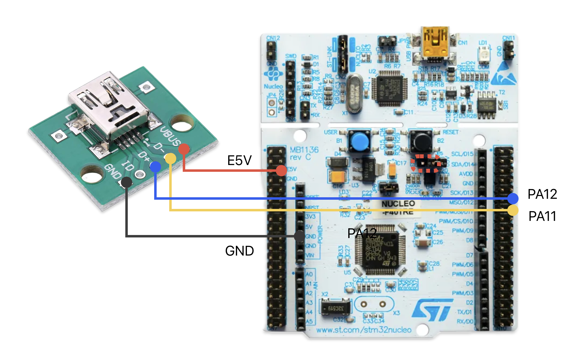

# Akeome Keybonard Firmware

# Requirements
## Hardware
- Nucleo F446Re
- USB Connector


### Connections
| Nucleo Pin | USB Connector |
| :--------: | :-----------: |
|    PA12    |      D+       |
|    PA11    |      D-       |
|    E5V     |     VBus      |
|    GND     |      GND      |

> [!IMPORTANT]
> Set the JP5 jumper on the Nucleo to E5V.



## Software
### For MacOS

```zsh
brew install gcc-arm-embedded openocd
```

